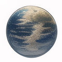
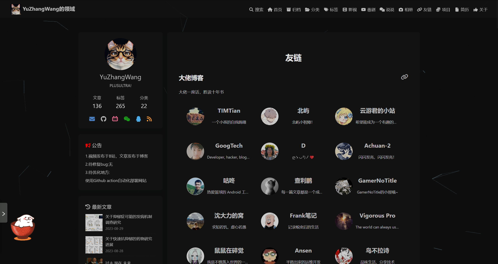

<a name="readme-top"></a>


<!-- 项目相关的一些图标信息 -->
<div align="center">
  <a href="https://github.com/YuZhangWang/Blog-Friend-Link/graphs/contributors">
        
  </a>
  <a href="https://github.com/YuZhangWang/Blog-Friend-Link/network/members">
        
  </a>  
  <a href="https://github.com/YuZhangWang/Blog-Friend-Link/stargazers">
        
  </a>  
  <a href="https://github.com/YuZhangWang/Blog-Friend-Link/issues">
        
  </a> 
  <a href="https://github.com/YuZhangWang/Blog-Friend-Link/blob/master/LICENSE.txt">
        
  </a> 
  </a> 
  <a href="https://yuzhang.wang/link">
        
  </a> 
  </a> 
  <a href="https://github.com/YuZhangWang/Blog-Friend-Link/blob/master/link.json">
        
  </a>   
</div>

<!-- 项目图标 -->
<br />
<div align="center">
  <a href="https://github.com/YuZhangWang/Blog-Friend-Link">
    
  </a>

<h3 align="center">Blog-Friend-Link</h3>

  <p align="center">
    YuZhangWang's Friendship Link
    <br />
    <a href="https://yuzhang.wang/131-remote-friend-linking/"><strong>Read the documentation »</strong></a>
    <br />
    <br />
    <a href="https://yuzhang.wang/link/">View Demo</a>
    ·
    <a href="https://github.com/YuZhangWang/Blog-Friend-Link/issues">Report Bug</a>
    ·
    <a href="https://github.com/YuZhangWang/Blog-Friend-Link/issues">Request Feature</a>
  </p>
</div>


<div align="center">
<a href="./README.md">简体中文</a> |
<a href="./README-EN.md">English</a>
</div>


<!-- TABLE OF CONTENTS -->
<details>
  <summary>Table of Contents</summary>
  <ol>
    <li>
      <a href="#Demonstration of effect">Demonstration of effect</a>
    </li>
    <li>
      <a href="#Friendly Link Description">Friendly Link Description</a>
      <ul>
        <li><a href="#Formula">Formula</a></li>
        <li><a href="#Content Principle">Content Principle</a></li>
      </ul>
    </li>
    <li><a href="#Specification">Specification</a></li>
    <li><a href="#How to exchange links">How to exchange links</a></li>
    <li><a href="#Contributing">Contributing</a></li>
    <li><a href="#License">License</a></li>
    <li><a href="#Contact">Contact</a></li>
    <li><a href="#Acknowledgments">Acknowledgments</a></li>
  </ol>
</details>


<!-- Demonstration of effect -->
## Demonstration of effect


<p align="right">(<a href="#readme-top">back to top</a>)</p>


<!-- Friendly Link Description -->
## Friendly Link Description

If you want to exchange links with us, please also read the content. Thank you for your cooperation.

If you want to change your link, description, avatar, etc., please create a new `Pull Request` here.

### Formula

- The links you apply for will be screened (please fill in the format).
- In principle, it is preferable that the site uses HTTPS protocol and has its own independent domain name.
- We use Git and GitHub.
- Added links will not be easily deleted. If you have removed the link to this site, this site will also remove the link.
- If the site has been inaccessible for a long time, or has not been updated for more than half a year, I will remove the links as appropriate.
- The final explanation right belongs to us.

### Content Principle

- No politically sensitive issues or illegal content.
- No excessive advertisements that are unsightly or malicious scripts.
- Preferably a site with substantial original content. (Including but not limited to)
  - Articles that can help others
  - Articles about your life that can help others to know more about you.
  - Sharing of your own amateur creations
  - Sharing of your own personal favorites
- At least 10 original articles (as this is the way to determine if you intend to stick around and get to know you).
- Reprints must be credited.

<p align="right">(<a href="#readme-top">back to top</a>)</p>


<!-- Specification EXAMPLES -->
## Specification

``` JSON
{
    "name": "YuZhangWang的领域",
    "link": "https://yuzhang.wang",
    "avatar": "https://gcore.jsdelivr.net/gh/YuZhangWang/Creative-pictures02@master/img/202210171416164.png",
    "descr": "PLUSULTRA!"
}
```

- `name`: blog name
- `link`: link to the blog
- `avatar`: the link to the avatar image, must use HTTPS (must be square or round), under the premise of guaranteeing the clarity, the smaller the more conducive to the rapid loading of the display.
- `descr`: one sentence description, describe `yourself` or `site` or `favorite words`? (It better not be too long, or it will be cut off.)

<p align="right">(<a href="#readme-top">back to top</a>)</p>


<!-- How to exchange links -->
## How to exchange links

- `Fork` this repository on GitHub
- Follow the format above in the [`link.json`](. /link.json) file, select your category in `Big Brother Blogs (at least 50 followers on Github)` `Special Links (Organizations, etc.)` `Peeps`, and add your information at the beginning of the category (copy other people's and put it at the top of the category to modify it).
- When you're done, create a new `Pull Request`, and use your favorite emoji + your URL in the PR title, e.g. `☁️ yuzhang.wang`, of course, if you have other more creative ways, it's totally fine.
- When `Pull Request` is merged, please add the link to your site as soon as possible, and your site will be shown in [YuZhangWang's friends](https://yuzhang.wang/link/) within 10 minutes.

<p align="right">(<a href="#readme-top">back to top</a>)</p>


<!-- CONTRIBUTING -->
## Contributing

Contributions are what make the open source community such an amazing place to learn, inspire, and create. Any contributions you make are **greatly appreciated**.

If you have a suggestion that would make this better, please fork the repo and create a pull request. You can also simply open an issue with the tag "enhancement".
Don't forget to give the project a star! Thanks again!

1. Fork the Project
2. Create your Feature Branch (`git checkout -b feature/AmazingFeature`)
3. Commit your Changes (`git commit -m 'Add some AmazingFeature'`)
4. Push to the Branch (`git push origin feature/AmazingFeature`)
5. Open a Pull Request

<p align="right">(<a href="#readme-top">back to top</a>)</p>


<!-- LICENSE -->
## License

Distributed under The GLP-3.0 and The 996.ICU License. See <a href="./LICENSE">LICENSE</a> and <a href="./LICENSE-996.ICU">LICENSE-996.ICU</a> for more information.

<p align="right">(<a href="#readme-top">back to top</a>)</p>


<!-- CONTACT -->
## Contact

YuZhangWang - YuZhangWang233@163.com

More contact information:
[ YuZhangWang](https://github.com/YuZhangWang) or
[YuZhangWang的领域](https://yuzhang.wang/about)

<p align="right">(<a href="#readme-top">back to top</a>)</p>


<!-- ACKNOWLEDGMENTS -->
## Acknowledgments

* [云游君的小伙伴们](https://github.com/YunYouJun/friends)
* [Awesome-Repository-Template](https://github.com/YuZhangWang/Awesome-Repository-Template)

<p align="right">(<a href="#readme-top">back to top</a>)</p>