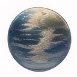

<a name="readme-top"></a>


<!-- 项目相关的一些图标信息 -->
<div align="center">
  <a href="https://github.com/YuZhangWang/Blog-Friend-Link/graphs/contributors">
        
  </a>
  <a href="https://github.com/YuZhangWang/Blog-Friend-Link/network/members">
        
  </a>  
  <a href="https://github.com/YuZhangWang/Blog-Friend-Link/stargazers">
        
  </a>  
  <a href="https://github.com/YuZhangWang/Blog-Friend-Link/issues">
        
  </a> 
  <a href="https://github.com/YuZhangWang/Blog-Friend-Link/blob/master/LICENSE.txt">
        
  </a> 
  </a> 
  <a href="https://yuzhang.wang/link">
        
  </a> 
  </a> 
  <a href="https://github.com/YuZhangWang/Blog-Friend-Link/blob/master/link.json">
        
  </a>   
</div>


<!-- 项目图标 -->
<br />
<div align="center">
  <a href="https://github.com/YuZhangWang/Blog-Friend-Link">
    
  </a>

<h3 align="center">Blog-Friend-Link</h3>

  <p align="center">
    YuZhangWang的友链
    <br />
    <a href="https://yuzhang.wang/131-remote-friend-linking/"><strong>阅读说明文档 »</strong></a>
    <br />
    <br />
    <a href="https://yuzhang.wang/link/">View Demo</a>
    ·
    <a href="https://github.com/YuZhangWang/Blog-Friend-Link/issues">Report Bug</a>
    ·
    <a href="https://github.com/YuZhangWang/Blog-Friend-Link/issues">Request Feature</a>
  </p>
</div>


<div align="center">
<a href="./README.md">简体中文</a> |
<a href="./README-EN.md">English</a>
</div>


<!-- TABLE OF CONTENTS -->
<details>
  <summary>目录</summary>
  <ol>
    <li>
      <a href="#效果演示">效果演示</a>
    </li>
    <li>
      <a href="#友链说明">友链说明</a>
      <ul>
        <li><a href="#原则">原则</a></li>
        <li><a href="#内容原则">内容原则</a></li>
      </ul>
    </li>
    <li><a href="#格式">格式</a></li>
    <li><a href="#如何交换友链">如何交换友链</a></li>
    <li><a href="#加入这个项目">加入这个项目</a></li>
    <li><a href="#liceBlog-Friend-Linknse">License</a></li>
    <li><a href="#联系作者">联系作者</a></li>
    <li><a href="#致谢">致谢</a></li>
  </ol>
</details>


# 效果演示


<p align="right">(<a href="#readme-top">回到顶部</a>)</p>


# 友链说明

如果您想和咱交换友链，还请阅读一下内容。谢谢配合～

如网站链接、描述、头像等信息更换，请在此创建新的 `Pull Request`。

## 原则

- 申请的友链将经过筛选（请按格式填好哦～）。
- 原则上最好为使用 HTTPS 协议站点，且拥有自己的独立域名。
- 会使用 Git 与 GitHub。
- 已添加友链不会轻易删除。如您已移除本站链接，本站也将移除友链。
- 站点长时间无法访问，或半年以上没有任何更新，我将视情况撤下友链。
- 最终解释权归咱自己所有。

<p align="right">(<a href="#readme-top">回到顶部</a>)</p>

## 内容原则

- 不存在政治敏感问题及违法内容。
- 没有过多的广告以致有碍观瞻、无恶意脚本。
- 最好是有实质性原创内容的网站。（包括但不局限于）
  - 能够帮助到别人的文章
  - 可以让别人更加了解你的生活类文章
  - 自己的业余创作分享
  - 有自己见解的喜好分享
- 至少有 10 篇原创文章（因为这样才能确定你是否有意坚持下去，并从中了解你）。
- 转载文章须注明出处。


<p align="right">(<a href="#readme-top">回到顶部</a>)</p>


# 格式

``` JSON
{
    "name": "YuZhangWang的领域",
    "link": "https://yuzhang.wang",
    "avatar": "https://gcore.jsdelivr.net/gh/YuZhangWang/Creative-pictures02@master/img/202210171416164.png",
    "descr": "PLUSULTRA!"
}
```

- `name`: 博客名称
- `link`: 博客链接
- `avatar`: 头像图片链接，须使用 HTTPS（须为正方形或圆形），在保证清晰度的前提下，越小越利于迅速加载展示哦～
- `descr`: 一句话描述，描述一下 `自己` 或者 `站点` 或者 `喜欢的话`？（最好不要太长，否则会被截断。）

<p align="right">(<a href="#readme-top">回到顶部</a>)</p>


<!-- ROADMAP -->
# 如何交换友链

- 在 GitHub 上 `Fork` 此仓库
- 按照以上格式在 [`link.json`](./link.json) 文件中，在`大佬博客(Github至少50followers)`  `特别链接(组织机构等)` `小伙伴们` 中选择你的类别，并在类别开头新增你的信息(直接复制其他人的放在这个类别最上面进行修改)
- 完成后，新建 `Pull Request`，PR 标题可以使用你喜欢的 emoji + 你的网址，譬如 `☁️ yuzhang.wang`，当然如果你有其他更有创意的方式，也完全 OK。
- 当 `Pull Request` 被合并后，请尽快于您的站点添加本站友链，您的站点将在 10 分钟内显示在[YuZhangWang的小伙伴](https://yuzhang.wang/link/)里。

<p align="right">(<a href="#readme-top">回到顶部</a>)</p>


<!-- CONTRIBUTING -->
# 加入这个项目

贡献是使开源社区成为一个学习、激励和创造的奇妙场所的原因。我们**非常感谢**你的任何贡献。

如果你有什么建议可以让它变得更好，请fork这个repo并创建一个pull request。你也可以简单地打开一个带有 "enhancement"标签的问题。
不要忘了给这个项目一颗星! 再次感谢!

1. Fork 这个项目
2. 创建你的功能分支 (`git checkout -b feature/AmazingFeature`)
3. 提交您的更改 (`git commit -m 'Add some AmazingFeature'`)
4. 推广到分支 (`git push origin feature/AmazingFeature`)
5. 打开一个Pull Request

<p align="right">(<a href="#readme-top">回到顶部</a>)</p>


<!-- LICENSE -->
# License

在GLP-3.0和996.ICU许可下发布。更多信息见<a href="./LICENSE">LICENSE</a> 和 <a href="./LICENSE-996.ICU">LICENSE-996.ICU</a>。

<p align="right">(<a href="#readme-top">回到顶部</a>)</p>


<!-- CONTACT -->
# 联系作者

YuZhangWang - YuZhangWang233@163.com

更多联系方式:
[ YuZhangWang](https://github.com/YuZhangWang) or
[YuZhangWang的领域](https://yuzhang.wang/about)

<p align="right">(<a href="#readme-top">回到顶部</a>)</p>


<!-- ACKNOWLEDGMENTS -->
# 致谢

* [云游君的小伙伴们](https://github.com/YunYouJun/friends)
* [Awesome-Repository-Template](https://github.com/YuZhangWang/Awesome-Repository-Template)

<p align="right">(<a href="#readme-top">回到顶部</a>)</p>